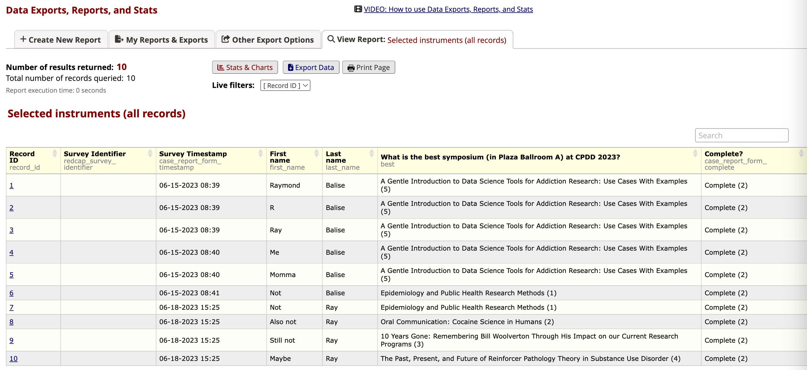

class: segue

00 - Open Source Computing and R

---

```{r setup, echo = FALSE}
knitr::opts_chunk$set(include = TRUE)

source("./assets/color_funs.R")

xaringanExtra::use_tile_view()
```

```{r, eval=FALSE, echo=FALSE}
# make pdf of slides
htmltools::tagList(rmarkdown::html_dependency_jquery())
xaringanBuilder::build_pdf("./index.Rmd")
```

```{r, echo=FALSE}
# Helper packages - need dplyr and ggplot
library(conflicted)
suppressMessages(conflict_prefer("select", "dplyr"))
suppressMessages(conflict_prefer("filter", "dplyr"))
suppressPackageStartupMessages(library(tidyverse))
library(ggthemes)

suppressPackageStartupMessages(library(tidymodels))
tidymodels_prefer()

library(knitr)

remotes::install_github("hadley/emo", quiet = TRUE)
```

class: segue

Open and Reproducible Data Science using R

---
# What could possibly go wrong?

+ Your SAS .red[license expired].
+ A person needs to be dropped from a study ... please .red[change **every** number] in a paper.
+ There is a person who is .red[1973 years old] in the needle exchange database. (Does heroin causes immortality?)
+ On revise and resubmit ... reviewer 2 wants you to add their favorite method or .red[describe *exactly* what was done] to process the data.
+ .red[What formula] does SPSS use to calculate standard errors for mixed effects models?
+ .red[Excel] is not your friend.

---
# We want tools that ...

+ are .red[free] 
+ are .red[open] to explore/expand
+ are .red[trustworthy] (if it is good enough for the FDA and big pharma....)
+ facilitate .red[reproducible] workflows
  + with manuscripts and analysis that are .red[knit] together
  + in papers with tables and figures which .red[fix themselves] when the data changes


???
https://blog.revolutionanalytics.com/2012/06/fda-r-ok.html


---
class:segue

R or Python

---

<br/><br/><br/>
> "Fast, Cheap or Good? Pick Two."  
    - Unknown 

We are sure R and Python are cheap.

---
# About R vs. Python ...

+ [Python is the second best language for everything.]( https://sixfeetup.com/blog/4-reasons-to-choose-python)
+ They both do .red[any analysis] you can think of.
+ They both support .red[reproducible research].
+ The R community is .red[friendly], patient, and community focused.
    + Posit (formerly R Studio) is a [B corp](https://www.bcorporation.net/en-us/).
  + https://www.datatrail.org/
+ Based on our experience, R is faster to .red[set up and learn] if you are starting from zero.
+ [R is the second most referenced language behind SPSS, which was released in 1968.](https://r4stats.com/articles/popularity/)

---
<br/>
> "R is the most user-hostile programming language money can't buy." 
    - Balise circa 2010 


> "I love R."
    - Balise circa 2023

---
# What changed?

+ In 2010 there were two good things about R.
<br/><br/>
.center[]

---
# What changed?
.center[]


---
# R is Modular

.center[]

---
# .blue[`dplyr`] does data processing with verbs

+ Verbs to work on a table of data:
  + .blue[`filter()`] - pick people
  + .blue[`arrange()`] - sort/order the people
  + .blue[`summarize()`] - describe people in groups
  + .blue[`select()`] - pick a measurement/feature/variable
  + .blue[`mutate()`] - make a new feature/variable
  + ... lots more

+ Verbs to combine data from multiple tables: 
  + .blue[`inner_join()`] - find common people in two datasets
  + ... a bunch more


---
# .blue[`ggplot2`] can make any graphic 

.pull-left[.center[]]


.pull-right[.center[]
.tiny[
https://github.com/allisonhorst/palmerpenguins/issues/75 - scatter and raincloud plots
]

]

---
# R Plays Well with Others

+ R can easily have a .red[conversation with a REDCap] database.
+ R can .red[read] any kind of data.  It has pipes in place to easily read from: 
  + Excel
  + SPSS/SAS/Stata/Minitab
  + The US Census
  + CDC Wonder/Epi Info
  + PubMed
  + ClinicalCode.org which has details on ICD-9/10 codes
  + SurveyMonkey and/or Qualtrix
  + ... so much more
  
  
---
class: segue

01 - Introduction to REDCap

```{r, echo=FALSE}
# Helper packages - need dplyr and ggplot
library(conflicted)
suppressMessages(conflict_prefer("select", "dplyr"))
suppressMessages(conflict_prefer("filter", "dplyr"))
suppressPackageStartupMessages(library(tidyverse))
library(ggthemes)

suppressPackageStartupMessages(library(tidymodels))
tidymodels_prefer()

library(knitr)

remotes::install_github("hadley/emo", quiet = TRUE)
```

---
# The Plan

.small[
.pull-left[
+ What is REDCap (and why bother)?
+ How to build a .red[basic case report form]
+ What is .red[rational] to do in REDCap
    + Multiple instruments
    + Longitudinal assessments
    + Repeated instruments
+ Show the Miami .red[needle exchange] database (IDEA)
+ Using .blue[`rUM`] to make a .red[publication-ready paper]
]
.pull-right[
+ The .red[manual export] (and why it is suboptimal)
+ .red[Importing all forms] from a REDCap project into R with .blue[`tidyREDCap`]
+ Using .blue[`tidyREDCap`] .red[summary] functions to add to a paper
<!-- + What `REDCapTidieR` does -->
<!-- + What `REDCapDM` does -->
<!-- + Getting data into REDCap with `REDCapR` -->
]
]

---
class: segue

What is REDCap (and why bother)?

---
# What's the big deal?

+ Based at .red[Vanderbilt] University and supported by the National Institutes of Health (.red[NIH])
+ Not open-source (the license specifies .red[noncommercial research] use only)
+ Continuous development since .red[2004]
+ Supports researcher- and participant-facing .red[data entry]
+ Supports .red[online and offline] data collection

---
# By the Numbers
+ .red[Free] to consortium members (slightly limited by international export controls)
+ Wildly .red[popular]  
  + 6,000+ institutions in more than 150 countries
  + Acknowledged in more than 23,000 articles

.center[]

---
# Legal

+ REDCap is 21 CFR .red[Part 11-ready]
+ Built-in .red[logging] and audit trails
+ Designed to support *safe harbor* .red[deidentification]
    
---
# How do I access it?

+ Most academic medical centers have it.
+ Check the .red[partner list]: https://projectredcap.org/partners/.
+ We will use the locked demostration project.
    + Normally, you will use point-and-click tools.
    + Today, we will show you things and you will have read-only access to some data.
    
---
class: segue

Workflows

---
# Fundamental Steps

1. Create a project
2. Add/create a data entry form/instrument
3. Collect/enter data
4. View/summarize in REDCap
5. Export for additional magic

---
# But wait... there's more!

+ .red[Multi-site] support with Data Access Groups
+ Built-in, .red[mutliple language] support
+ .red[Randomization]
+ Longitudinal projects with .red[study calendars] and .red[scheduling]
+ .red[Repeated instruments] for assessing unplanned repeats
    - Describe each "stop by" clinic visit
    - Describe each adverse event
+ Public or private .red[dashboards]
+ Send .red[emails/text]
+ .red[Extensible] via *External Modules*

---
# Create A Project $_1$

.center[]

---
# Create A Project $_2$

* Use the **Designer** to add your content.

.center[]

---
# Add/Create a Data Entry Instrument/Form

+ Add an instrument from the REDCap .red[Shared Instrument Library] (at Vanderbilt).  
+ Make .red[your own] data entry form.
+ Do both.

.center[]

---
# REDCap Shared Instrument Library $_1$

* You can point and click to add one of the thousands of instruments in the REDCap library.

.center[]


---
# REDCap Shared Instrument Library $_2$

.center[]


---
# REDCap Shared Instrument Library $_3$

.center[]

---
# REDCap Shared Instrument Library $_4$

.center[]

---
# REDCap Shared Instrument Library $_5$

.center[]

---
# REDCap Shared Instrument Library $_6$

The license for the instruments bans meaningful changes but you can change the appearance and set details:

.center[]


---
# REDCap Shared Instrument Library 
## We Need You!

+ We want to add more standardized instruments!
  + They must be free to distribute and have at least one peer-reviewed article with "standardization" information.
+ The coding guidelines that the library uses are here:  

https://projectredcap.org/wp-content/resources/redcap_library_coding_guidelines.pdf


---
# Create a Form - Question/Field Bank  $_1$

.center[]

---
# Create a Form - Question/Field Bank  $_2$

+ The NIH .red[C]ommon .red[D]ata .red[E]lement Repository allows you to code questions consistently.

.center[]

---
# Create a Form - Question/Field Bank  $_3$

Inside the NIH CDE Repository, the NCI variables are rich:

.center[]

.center[]


---
# Create a Form - Question/Field Bank $_4$

.center[]

---
# Create a Form - Custom Questions $_1$

.center[]

---
# Create a Form - Custom Questions $_2$

You can make truly custom forms by adding your own field:

.center[]

.red[NOTICE:] Text can/should have .red[validation].

---
# Create a Form - Custom Questions $_3$

.center[]

---
# Create a Form - Custom Questions $_4$

.center[]

---
# Create a Form - Custom Questions $_5$

.center[]

---
# Collect/Enter Data $_1$
 
.pull-left[
+ After you have created your forms, the research team can enter data or you can turn the form into a survey.
+ To use surveys, you need to enable them for a project, then tag an individual form as a survey.
]

.pull-right[
.center[]
]

.center[]

---
# Collect/Enter Data $_2$

+ The survey needs to be the first questionnaire/instrument.

.center[]

.center[]

---
# Collect/Enter Data $_3$

.center[]

---
# Collect/Enter Data $_4$

.center[]


---
# View/Summarize in REDCap

+ You can easily make:
    + public/private dashboards with summary statistics and basic graphics
    + quick **Stats & Charts** reports
    + tabular reports

---
# Dashboards $_1$

.center[]

---
# Dashboards $_2$

.center[]

---
# Dashboards $_3$

.center[      ]

---
# Dashboards $_4$

.center[]

---
# Dashboards $_5$

.center[]

---
# Dashboards $_6$

.center[]

---
# Dashboards $_7$

.center[]

---
# Stats & Charts $_1$

.center[]

---

.center[]

---
# Tabular Reports $_1$

.center[]

---
# Tabular Reports $_2$

.center[]

---
# Export for Additional Magic $_1$

+ You can manually export any tabular report.

.center[]

---
# Export for Additional Magic $_2$

+ Export a single form.

.center[]

---
# Export for Additional Magic $_3$

.center[]

---
# Export for Additional Magic $_4$

.center[]

---
# Export for Additional Magic $_5$

.pull-left-60[]

.pull-right-36[]

---
# API Export for Better Magic $_1$


---
class: segue

02 - Using REDCap, R, and Markdown to Produce Publications

---
class: segue

Infectious Disease Elimination Act

---
# Intersecting Epidemics

+ HIV
+ hepatitis C
+ overdose deaths

---
.pull-left[


]


.pull-right[]

???
downloaded 2023-03-03
https://map.aidsvu.org/map
https://www.cdc.gov/hepatitis/statistics/2018surveillance/HepC.htm 

---

.center[

]

---

.center[

]

---
# Harm Reduction

.center[
https://www.youtube.com/watch?v=ldTxMIblePk

<iframe src="https://www.youtube.com/embed/ldTxMIblePk" title="One Doctor’s Needle Fix" frameborder="0" allow="accelerometer; autoplay; clipboard-write; encrypted-media; gyroscope; picture-in-picture; web-share"  allowfullscreen></iframe>
]

---
## National Institute on Drug Abuse (NIDA) Videos


.center[
Addressing Barriers to Care

https://www.youtube.com/watch?v=2d_3DqMEdEg

What is Harm Reduction?

https://www.youtube.com/watch?v=ikmKxgCTXFA


Caring for People Who Use Drugs

https://www.youtube.com/watch?v=7RI72zvO2dU

]

---
# IDEA Syringe Services Program

+ The Infectious Disease Elimination Act (IDEA) of 2016 was signed into law on July 1, 2016.
+ This policy authorized the University of Miami to open the .red[first] legal syringe services program (or .red[needle exchange]) in the state of .red[Florida]
    + decriminalized possession and distribution of syringes for those engaged in the program
    + 5-year, unfunded pilot project, set to end in July, 2021

+ Prior to implementation, REDCap was used to build a data collection system to evaluate the pilot program with the sole purpose of .red[providing data to the legislature] to enhance advocacy efforts for statewide expansion of the program.

---
class: segue

Infectious Disease Elimination Act - REDCap

---
# Current Database

+ More than 2,100 people have been helped.
+ Lessons Learned
   + Services variables were added.
   + Questions were added and some dropped.
   + Not all variables were validated.
+ Using new features in REDCap
   
   
---
# New Version for the Other Sites

.pull-left[
+ a .red[single, fixed/mobile] project for each county
+ .red[multiple instruments] in the project
+ follows .blue[`tidyverse`] naming convention
+ removes .red[dropped content]
+ .red[validation] on all text
+ numeric .red[calculated fields] 
  + for needle supply by size
+ .red[calculated text] and hidden fields using action tags
]
.pull-right[
+ .red[automatic alerts] for testing (HIV/Hep C)
  + referrals (smart variables for latest info)
+ added .red[supply tracking] (not shown here)
+ greatly improved .red[aesthetics] & .red[organization]
    + Custom HTML/CSS
    + Field embedding
+ .red[Data Access Groups] for locations in a county
]
    
---
# Show and Tell - Designer


---
# Show and Tell - Repeated


---
# Show and Tell - Add Typical


---
# Show and Tell - Add


---
# Show and Tell - Enrollment

.scroll-box-18[

]

---
# Show and Tell - Enrollment

.scroll-box-18[
.center[

]
]


---
# Show and Tell - Daily

.scroll-box-18[
.center[

]]

---
# Show and Tell - Naloxone

.scroll-box-18[
.center[

]]

---
# Before and After Field Embedding

.pull-left[
.scroll-box-16[

]
]
.pull-right[

]


---
class: segue

Integrating with R


---
# .blue[`rUM`]

+ I teach in a medical school (i.e., smart people who are not programmers).
+ I teach `r` at `UM`, so to support my students, I give them .blue[`rUM`].
+ It has menu-driven tools to add `R Markdown` code or to add complete projects.
+ The projects contain:
    + Quarto or R Markdown paper shells for manuscripts
        + full-featured YAML header
        + code to add used packages to the paper bibliography
    + an aggressive .gitignore file
    + a data folder
    
---
# .blue[`rUM`] Uses Posit's Brilliance

+ .blue[`rUM`] uses the Quarto and R Markdown magic that Yihui Xie and his colleagues at Posit/RStudio and around the world have created.

.center[
<https://quarto.org/>
]

.pull-left[
.center[

<br/>
[R Markdown: The Definitive Guide](https://bookdown.org/yihui/rmarkdown/)
]]
.pull-right[
.center[

<br/>
[R Markdown Cookbook](https://bookdown.org/yihui/rmarkdown-cookbook/)  
]]

---
# Using .blue[`rUM`]  

+ Install with .blue[`remotes::install_cran("rUM")`] or .blue[`install.packages("rUM")`].
+ Completely stop and restart all your instances of RStudio. There are hooks into the graphical user interface, so you need a FULL restart. Expect problems if you just try to restart R.

---
# Add a Splash of .blue[`rUM`]

+ .blue[`rUM`] has a bunch of .red[headers] that include YAML and setup instructions. A header is setup code that "always" appears at the top of a program.

.pull-left[
1)  From the RStudio file menu, choose R Markdown...


]
.pull-right[
2) Choose From Template and then choose "html2 with rUM":


]

---

.scroll-box-18[

]

---
# Make a .blue[`rUM`]-Infused Project

.pull-left-36[


]

.pull-right-60[


```{r, eval=FALSE}
rUM::make_project(
  path,
  type = c("Quarto (analysis.qmd)", "R Markdown (analysis.Rmd)")
)
```
]

---


---
.pull-left[
### R Markdown

]

.pull-right[
### Quarto

]

---
# The Default Ouput

.center[

]

---
# Use the Visual Editor to Do Stuff

.pull-left[
+ point-and-click formatting
+ basic tables
+ images 
+ add references/citations

In the Visual Editor, typing .red[⌘ /] on Mac or .red[cmd /] on Linux/Windows is very useful.

]
.pull-right[
.center[

]
]

---
# The Bibliography

+ The bibliography section of the template has code to find the packages used in the R Markdown or Quarto file and add them to the "packages.bib" file.


```
# automatically create a bib database for loaded R packages & rUM
knitr::write_bib(
  c(
    .packages(),
    "rUM",
    "table1"
  ),
  "packages.bib"
)
```

---
# Use Package

+ Say you add .blue[`library(tidymodels)`] to your analysis file.
+ After you "knit" or "render" once, the package details will be added to the "packages.bib" file.  

.center[

]

---
class: hide-slide-number

# Reference It

+ You can copy and paste the reference examples that are in the *Methods* (or point and click) to add it to the text in your methods section.

.pull-left[


]

.pull-right[

]

---
# Reference Style

By default, the style is set to be New England Journal of Medicine.  That is controlled by one line in the YAML header 

```
csl: the-new-england-journal-of-medicine.csl
```

and a details file that you can get from here: https://www.zotero.org/styles
.center[

]
Save the CSL file into the project directory and tweak the YAML.

---
# .gitignore 

+ I teach workflows that use git and GitHub to students in the medical school.  So .blue[`rUM`]-infused projects include my very aggressive **.gitignore** file.  It attempts to block common dataset formats (Excel, Python, R, SAS, SPSS, STATA, text, and zip files). Take a look and tell me if I am missing anything.

.scroll-box-18[
```
# Version 2022-08-12

# History files
.Rhistory
.Rapp.history

# Session Data files
.RData
*.RData

# User-specific files
.Ruserdata

# Example code in package build process
*-Ex.R

# Output files from R CMD build
/*.tar.gz

# Output files from R CMD check
/*.Rcheck/

# RStudio files
.Rproj.user
.Rproj.user/

# produced vignettes
vignettes/*.html
vignettes/*.pdf

# OAuth2 token, see https://github.com/hadley/httr/releases/tag/v0.3
.httr-oauth

# knitr and R markdown default cache directories
*_cache/
/cache/

# Temporary files created by R markdown
*.utf8.md
*.knit.md

# R Environment Variables
.Renviron

# Mac
.DS_Store
.Thumbs.db
Thumbs.db

# R projects 
*.Rproj

# Directories
docs/
data/
development/
macros/
output/
sasdata/
libs/

# Exclude .Rmd output
*.html
**/figure-html/

# Exclude Text
*.txt
*.Txt
*.TXT

# Exclude Excel
*.xlsx
*.xls

# R data
*.rds
*.RDS
*.Rds
*.rda
*.RDA
*.Rda

# csv data
*.csv
*.CSV
*.Csv

# sas data
*.sas7bdat
*.sas7bcat

# SPSS data
*.sav
*.SAV
*.Sav

# SPSS output
*.spv
*.SPV
*.Spv

# STATA data
*.dta
*.DTA
*.Dta

# STATA log files
*.log
*.LOG
*.Log
*.smcl
*.SMCL
*.Smcl

# data commonly used in Python
*.json
*.pkl
*.h5
*.msgpack
*.parquet
*.feather

# VSC
www/.vscode/

# Bookdown book
_book/
_bookdown_files/

# Binary - Powerpoint and iThoughtsX
*.ppt
*.pptx
*.itmz

# R packages
*.tar

# Archives
*.zip
*.Zip
*.ZIP

# Quarto
/.quarto/
/_site/
.quarto/
_site/
```
]

---
class: segue

REDCap Processing with `tidyREDCap`

---
# What .blue[`tidyREDCap`] Does

1. Easy imports into R from REDCap
  + [import_instruments()](https://raymondbalise.github.io/tidyREDCap/articles/import_instruments.html0) imports all data with labels (i.e., the text that appears on the survey page).
2. Summarizes categorical variables
  + [make_choose_one_table()](https://raymondbalise.github.io/tidyREDCap/articles/makeChooseOneTable.html) makes a summary of a choose-one question.
  + [make_choose_all_table()](https://raymondbalise.github.io/tidyREDCap/articles/makeChooseAllTable.html) shows counts of all the options chosen from choose-all questions.
  + [make_binary_word()](https://raymondbalise.github.io/tidyREDCap/reference/make_binary_word.html) shows response patterns from choose-all questions.
<br>  
.center[[https://raymondbalise.github.io/tidyREDCap/](https://raymondbalise.github.io/tidyREDCap/)]

---
# Import Everything with .blue[`tidyREDCap::import_instruments()`]

+ .blue[`tidyREDCap`] allows you to pull in all the instruments by adding a .blue[`tidyREDCap::import_instruments()`] call.  All you need is the .red[URL] for your copy of REDCap and your .red[API] token.
+ .red[Do not save your API token in your code.]  It is way too easy to accidentally give away your password.
+ There are good options to securely store your API keys.  If you work on an secure/encrypted machine, a fair alternative is to store your API keys in your *R environment* file. I use: .blue[`usethis::edit_r_environ()`]
    
---
# Store Your API Token

+ Copy the token (password text) from REDCap.

.center[

]

+ Open your R environment file with .blue[`usethis::edit_r_environ()`] and give your token a meaningful name. Use an `=` and quote the string.
.center[

]

---
# Add Code to Load

+ Typically you would just do:

```{r eval=FALSE}
tidyREDCap::import_instruments(
  "https://redcap.miami.edu/api/", 
  Sys.getenv("nacho_anxiety_key") 
)
```

+ Because this project uses a custom subject ID name and numbering, do:

```{r eval=FALSE}
# run me once
tidyREDCap::import_instruments(
  url = "https://redcapdemo.vanderbilt.edu/api/", 
  token = Sys.getenv("fake_idea_data_cpdd"), 
  record_id= "id_code", first_record_id = "07"
)
```

```{r echo=FALSE, eval=FALSE}
# run me once
library(readr)
write_rds(daily, "./data/daily.rds")
write_rds(enrollment, "./data/enrollment.rds")
```

```{r eval=FALSE, echo=FALSE}
daily <- read_rds("./data/daily.rds")
enrollment <- read_rds("./data/enrollment.rds")
```


---
# Loaded Data


.center[


]

* The data is imported and the variables have labels:

.pull-left[

]
.pull-right[

]

---
# The Origin of .blue[`tidyREDCap`]

+ Novices could not process the export of choose-all-that-apply questions.
  + For example, the export has a column for Carfentanil, Cocaine, Crack, etc.
+ How do we get the count of all the chosen things?
+ How can we look at co-occurring patterns?
.center[

]


---
# .blue[`make_choose_one_table()`]

```{r, eval=FALSE}
library(tidyREDCap)
enrollment |> 
    make_choose_one_table(injection_drugs___1) |> 
    knitr::kable()
```


---
# .blue[`make_choose_all_table()`]

.pull-left[
+ Merge all the choices into a single column and do a count:

```{r eval=FALSE}
library(tidyREDCap)
enrollment |> 
  make_choose_all_table("injection_drugs__") |> 
  knitr::kable() 
```
]

```{r, echo=FALSE}
enrollment_table <-
    structure(c("|What                               | Count|", "|:----------------------------------|-----:|", 
"|Carfentanil                        |     1|", "|Cocaine                            |     5|", 
"|Crack                              |     2|", "|Fentanyl                           |     9|", 
"|Heroin                             |    12|", "|Hormones                           |     0|", 
"|Methamphetamine                    |     6|", "|Pain Killers                       |     0|", 
"|Prescription Opioids               |     1|", "|Speedball                          |     9|", 
"|Steroids                           |     0|", "|Tranquilizers                      |     2|", 
"|Other non-prescription             |     1|", "|Some other prescription medication |     0|", 
"|None                               |     3|", "|Refused or dont know               |     1|"
), format = "pipe", class = "knitr_kable")
```


.pull-right[
.center[
.scroll-box-16[
```{r echo=FALSE, eval=params$use_data}
library(tidyREDCap)
enrollment_table
```
]]]

---
# .blue[`make_binary_word()`] $_1$

.pull-left[
.small[
+ Use _ or a letter to show co-occurring patterns:


| Var | Abbreviation | Drug                 |
| :-- | :----------  | :------------------- |
| 1   | R            | Carfentanil          |
| 2   | C            | Cocaine              |
| 3   | K            | Crack                |
| 4   | F            | Fentanyl             |
| 5   | H            | Heroin               |
| 7   | M            | Methamphetamine      |
| 8   | P            | Pain Killers         |
| 9   | O            | Prescription Opioids |
| 10  | S            | Speedball            |

]]

.pull-right[
.smaller[
```{r echo=FALSE, eval=FALSE}
suppressPackageStartupMessages(library(tidyverse))
suppressPackageStartupMessages(library(kableExtra))


labels <- c("R", "C", "K", "F", "H", "M", "P", "O", "S")

pattern <- 
  enrollment |> 
  select(
    injection_drugs___1:injection_drugs___5, 
    injection_drugs___7:injection_drugs___10
  ) |> 
  make_binary_word(the_labels = labels) 

janitor::tabyl(pattern) |> 
  janitor::adorn_pct_formatting(digits =2) |> 
  knitr::kable() 

```

```{r echo=FALSE}
suppressPackageStartupMessages(library(tidyverse))
suppressPackageStartupMessages(library(kableExtra))

example_binary_word <- 
structure("<table>\n <thead>\n  <tr>\n   <th style=\"text-align:left;\"> pattern </th>\n   <th style=\"text-align:right;\"> n </th>\n   <th style=\"text-align:left;\"> percent </th>\n  </tr>\n </thead>\n<tbody>\n  <tr>\n   <td style=\"text-align:left;\"> R________ </td>\n   <td style=\"text-align:right;\"> 1 </td>\n   <td style=\"text-align:left;\"> 2.94% </td>\n  </tr>\n  <tr>\n   <td style=\"text-align:left;\"> _C_F____S </td>\n   <td style=\"text-align:right;\"> 1 </td>\n   <td style=\"text-align:left;\"> 2.94% </td>\n  </tr>\n  <tr>\n   <td style=\"text-align:left;\"> _C_F_____ </td>\n   <td style=\"text-align:right;\"> 1 </td>\n   <td style=\"text-align:left;\"> 2.94% </td>\n  </tr>\n  <tr>\n   <td style=\"text-align:left;\"> _C__HM__S </td>\n   <td style=\"text-align:right;\"> 1 </td>\n   <td style=\"text-align:left;\"> 2.94% </td>\n  </tr>\n  <tr>\n   <td style=\"text-align:left;\"> _C__H__OS </td>\n   <td style=\"text-align:right;\"> 1 </td>\n   <td style=\"text-align:left;\"> 2.94% </td>\n  </tr>\n  <tr>\n   <td style=\"text-align:left;\"> _C___M___ </td>\n   <td style=\"text-align:right;\"> 1 </td>\n   <td style=\"text-align:left;\"> 2.94% </td>\n  </tr>\n  <tr>\n   <td style=\"text-align:left;\"> __K______ </td>\n   <td style=\"text-align:right;\"> 2 </td>\n   <td style=\"text-align:left;\"> 5.88% </td>\n  </tr>\n  <tr>\n   <td style=\"text-align:left;\"> ___F_M__S </td>\n   <td style=\"text-align:right;\"> 1 </td>\n   <td style=\"text-align:left;\"> 2.94% </td>\n  </tr>\n  <tr>\n   <td style=\"text-align:left;\"> ___F_____ </td>\n   <td style=\"text-align:right;\"> 6 </td>\n   <td style=\"text-align:left;\"> 17.65% </td>\n  </tr>\n  <tr>\n   <td style=\"text-align:left;\"> ____H___S </td>\n   <td style=\"text-align:right;\"> 4 </td>\n   <td style=\"text-align:left;\"> 11.76% </td>\n  </tr>\n  <tr>\n   <td style=\"text-align:left;\"> ____H____ </td>\n   <td style=\"text-align:right;\"> 6 </td>\n   <td style=\"text-align:left;\"> 17.65% </td>\n  </tr>\n  <tr>\n   <td style=\"text-align:left;\"> _____M___ </td>\n   <td style=\"text-align:right;\"> 3 </td>\n   <td style=\"text-align:left;\"> 8.82% </td>\n  </tr>\n  <tr>\n   <td style=\"text-align:left;\"> ________S </td>\n   <td style=\"text-align:right;\"> 1 </td>\n   <td style=\"text-align:left;\"> 2.94% </td>\n  </tr>\n  <tr>\n   <td style=\"text-align:left;\"> _________ </td>\n   <td style=\"text-align:right;\"> 5 </td>\n   <td style=\"text-align:left;\"> 14.71% </td>\n  </tr>\n</tbody>\n</table>", format = "html", class = "knitr_kable")

example_binary_word
```

]]


---
# .blue[`make_binary_word()`] $_2$
.pull-left-60[
```{r eval=FALSE}
suppressPackageStartupMessages(library(tidyverse))

labels <- 
  c("R", "C", "K", "F", "H", "M", "P", "O", "S")

pattern <- 
  enrollment |> 
  select(
    injection_drugs___1:injection_drugs___5, 
    injection_drugs___7:injection_drugs___10
  ) |> 
  make_binary_word(the_labels = labels)

janitor::tabyl(pattern) |> 
  janitor::adorn_pct_formatting(digits =2) |> 
  knitr::kable()

```
]
.pull-right-36[
.center[
.smaller[
```{r echo=FALSE, eval=FALSE}
labels <- c("R", "C", "K", "F", "H", "M", "P", "O", "S")

pattern <- 
  enrollment |> 
  select(
    injection_drugs___1:injection_drugs___5, 
    injection_drugs___7:injection_drugs___10
  ) |> 
  make_binary_word(the_labels = labels)

janitor::tabyl(pattern) |> 
  janitor::adorn_pct_formatting(digits =2) |> 
  knitr::kable()

```

```{r echo=FALSE}
example_binary_word
```


]]]

---
# But wait there is more!

+ .blue[`tidyREDCap`] also has tools for converting checked/unchecked/unknown into yes/no responses.

```{r echo=FALSE}
example_enrollment <-
    structure(c("Unchecked", "Unchecked", "Unchecked", "Unchecked", 
"Unchecked", "Unchecked", "Unchecked", "Unchecked", "Unchecked", 
"Unchecked", "Unchecked", "Unchecked", "Unchecked", "Unchecked", 
"Unchecked", "Unchecked", "Unchecked", "Unchecked", "Unchecked", 
"Unchecked", "Unchecked", "Unchecked", "Unchecked", "Unchecked", 
"Unchecked", "Unchecked", "Unchecked", "Unchecked", "Unchecked", 
"Unchecked", "Unchecked", "Checked", "Unchecked", "Unchecked"
), label = "In the past 30 days, which injection drugs have you used?: Carfentanil", class = c("labelled", 
"character"))
```


```{r eval=FALSE}
library(tidyREDCap)
make_yes_no(enrollment$injection_drugs___1) |> 
  tidyREDCap::make_choose_one_table()
```

```{r echo=FALSE}
structure(list(Response = structure(1:2, levels = c("No or Unknown", 
"Yes"), class = "factor"), n = c(33, 1), percent = c("97%", "3%"
)), row.names = c(NA, -2L), core = structure(list(Response = structure(1:2, levels = c("No or Unknown", 
"Yes"), class = "factor"), n = c(33L, 1L), percent = c(0.970588235294118, 
0.0294117647058824)), class = "data.frame", row.names = c(NA, 
-2L)), tabyl_type = "one_way", class = c("tabyl", "data.frame"
)) -> example_yes_no
example_yes_no
```


```{r eval=FALSE}
make_yes_no_unknown(enrollment$injection_drugs___1) |> 
  tidyREDCap::make_choose_one_table()
```

```{r echo = FALSE}
structure(list(Response = structure(1:3, levels = c("No", "Yes", 
"Unknown"), class = "factor"), n = c(33, 1, 0), percent = c("97%", 
"3%", "0%")), row.names = c(NA, -3L), core = structure(list(Response = structure(1:3, levels = c("No", 
"Yes", "Unknown"), class = "factor"), n = c(33L, 1L, 0L), percent = c(0.970588235294118, 
0.0294117647058824, 0)), class = "data.frame", row.names = c(NA, 
-3L)), tabyl_type = "one_way", class = c("tabyl", "data.frame"
))-> example_yes_no_unk
example_yes_no_unk
```


---
# Thank you!
.smaller[
.pull-left[
+ IDEA
  + Hansel Tookes, MD MPH, University of Miami
  + Tyler Bartholomew, PhD, University of Miami 
  + Belen del Sol Hervera, MPH, University of Miami
+ .blue[`rUM`]
  + Gabriel Odom, PhD, Florida International University 
  + Kyle Grealis, MS, University of Miami
  + Francisco Cardoza, (almost PhD) University of Miami
  + Frank Gutierrez, MS, University of Miami
]
.pull-right[
+ .blue[`tidyREDCap`]
  + Gabriel Odom, PhD, Florida International University 
  + Anna Calderon, MS, University of Miami
  + Layla Bouzoubaa, MSPH, Drexel University
  + Wayne DeFreitas, MS,  University of Miami
  + Lauren Nahodyl, MS, University of Miami
  + Lionel Henry, Posit
  + Davis Vaughan, Posit
  
+ All of this work
  + Daniel Feaster, PhD, University of Miami
  + The R and R/Medicine community
  + Lori Balise 
]]

---
# Funding That Made This Work Possible

+ Healing Communities Study: Developing and Testing an Integrated Approach to Address the Opioid Crisis-New York State. National Institute on Drug Abuse, 1 UM1 DA049415
+ CTN-0094 Individual Level Predictive Modeling of Opioid Use Disorder Treatment Outcome. Florida Node Alliance of The Drug Abuse Clinical Trials Network (NIDA) UG1 DA013720
+ University of Miami Center for HIV and Researching Mental Health (CHARM) NIH 1P30MH116867-01A1
+ University of Miami, Sylvester Comprehensive Cancer Center
+ Florida International University, Stempel College of Public Health  


---
class: segue

03 - Helper Modules for R

---

# Packages

+ Because of R's modular design it is easy to build packages for .red[domain specific] problems.
+ R packages 
  + typically contain .red[new code]/functions for data processing/summary/inference
  + have .red[standardized documentation]
  + can contain .red[datasets]
  + can contain .red[long form documentation] or even papers

---
# Years Cleaning and Harmonizing Data then a Package

+ CTN-0094 processed data from the .red[three largest clinical trials] on Medication Assisted Treatment (.red[MAT]) for Opioid Use Disorder (.red[OUD]): CTN-0027, CTN-0030, CTN-0051.
+ The documentation was suboptimal (.red[PDFs]) and the data required many hundreds of fixes. 
  + .red[Murphy's Law] for datasets
  + True problems - impossible and incorrect .red[dates]
  + Problematic values - .red[Free text] drug names
+ Data scientists with decades of experience at .red[Columbia and University of Miami] worked independently and meeting to resolve differences.

---
class: segue

`public.ctn0094data`

---
.pull-left[
# The Package
+ 25 datasets with documentation
+ 3 Long-form documentation vignettes
]
.pull-right[

]

---
# Manual Pages

.scroll-box-18[
.center[

]
]

---
# Vignettes

.center[

]

---

.center[

]

---
# Vignettes - Study Report - The Table Code


.scroll-box-18[
.center[

]]

---
# Vignettes - Harmizonation Details 

.center[

]

---
# Vignettes - Harmizonation Manuscript 


.scroll-box-18[
.center[

]]


---
class: segue

`DOPE`

---
# Drug Ontology Parsing Engine is .blue[`DOPE`]

+ In the CTN-0094 .red[Timeline Follow-back] data, there were .red[free text] fields for drugs.
+ We saw .red[brand, generic and street names]: "Acid", "Angel Dust", "Ativan", etc.
+ We combined data from the .red[DEA], .red[IQVIA] and the "no slang" .red[online street name dictionary].
+ The .blue[`DOPE`] function .blue[`lookup()`] allows us to query various drug name databases for matching names, classes, and categories.
+ The .blue[`DOPE`] package is here: <https://ctn-0094.github.io/DOPE/>


---
# Parsing Free-Text Fields with `lookup()`

```{r}
suppressPackageStartupMessages(library(DOPE))  # for the lookup() function
c("Acid", "Angel Dust", "Ativan", "Xylazine") %>% 
  lookup() %>% 
  kable()
```

+ For CTN-0094 data analysis (including work on polysubstance use), we grouped reported substances by the `class` field
+ Note that Xylazine doesn't exist in our database yet, so let us know if you're interested and want to .red[get involved].

---

.center[

]

---
# We need help with .blue[`DOPE`]!

+ This is an .red[unfunded] passion project. We would love to find funding for this work.
+ We want .red[more dictionaries] of slang terms.
+ We need a .red[contact at the DEA] to help us sort through their pulications.
+ We need subject matter experts!

---
class: segue

`public.ctn0094extra`


---
.pull-left[
# The CTN-0094 "Extra" Package
+ The .blue[`public.ctn0094data`] package is a relational database.
+ This database does not have "engineered" variables, so we found ourselves constantly re-calculating certain measurements for our analyses.
+ The .blue[`public.ctn0094data`] package contains "helper" datasets and functions.
]
.pull-right[

]


---

.pull-left-36[
.center[

]
]

.pull-right-60[
# Summarizing Drug Use Patterns

+ The data shown are only a few records for a single trial participant. .red[Is the treatment working?]
+ Drawing a quick clinical conclusion from this data is nearly impossible.
+ The .blue[`public.ctn0094extra`] package contains functions to turn the long-form data on the left into a compact summary of patient use.
+ Substance use pattern "words" are a compact summary of their opioid use over the course of the clinical trial.

]


---
# Substance Use Pattern "Words"

+ We summarize a participant's use of a class of substances for a single week in the trial protocol via the following "letters":
  - .red[**+**]: positive for the substance(s) by urine screen (or participant self-report/TLFB, if such data are of interest) at a specific visit or in a specified window of time (a day, week, etc.) 
  - .red[**–**]: negative for the substance(s) 
  - .red[**o**]: patient failed to provide a urine sample
  - .red[<b>\*</b>]: inconclusive results or mixed results (e.g., patient provided more than one urine sample in the time interval and the results did not agree)
  - .red[<b>\_</b>]: no specimens required per study design (weekends, holidays, pre-randomization period, alternating visit days/weeks, clinic excused visits)
+ For subject 2, their .red[opioid use pattern] during treatment is: .red[`+----oo-o-o-o+o`]

<!-- For the en dash above, I had to copy and paste it from the internet. The double dash wasn't rendering as an en dash anymore. -->


---
# Properties of "Words"

Because these patterns are being used to replace aspects of patient medical charts in analysis, they must have the following properties:

1. (*Machine-Readable*) It can be directly parsed by a .red[computer].
2. (*Human-Readable*) It can be quickly and easily interpreted by a .red[human].
3. (*Sufficient*) It represents .red[all of the same information] about the [univariate] sequence of interest that would be present in the full data.


---
# Summarized Opioid Use

We can compactly represent the substance use pattern (in this case opioid use pattern) for all the participants across various trial protocol phases in an easy-to-read form. Here are 10 real patients we chose as an example:

.pull-left[
```{r, echo = FALSE}
egPeople_int <- c(
  0163, 0210, 0242, 0004, 0017, 0013, 1103, 0033, 0233, 2089
)

opioidPattern_df <- 
  CTNote::outcomesCTN0094 %>% 
  filter(who %in% egPeople_int) %>% 
  select(
    Subject = who,
    `Treatment UDS` =  usePatternUDS
  ) 

opioidPattern_df
```
]

.pull-right[
+ .red[Which of these patients succeeded in treatment?]
+ .red[Which patients failed?]
]

---
class: segue

`CTNote`


---
.pull-left[
# The CTNote Package
+ The .blue[`CTNote`] package contains **o**uctomes, **t**reatment success measures, and **e**ndpoints used in Clinical Trials Network (**CTN**) studies.
+ The three vignettes form a library of 50+ coded trial endpoints used in various OUD clinical trials since the early 1970s. 
+ The standard wisdom is to group these algorithms into metrics of .red[Abstinence, Relapse, and Use Reduction]
+ <https://ctn-0094.github.io/CTNote/>
]
.pull-right[

]


---

.pull-left[
# Why So Many Endpoints?
```{r}
opioidPattern_df
```
]

.pull-right[
+ When you decided who "succeeded" and who "failed", did you look at:
  - End-of-study .red[strict abstinence]?
  - .red[Not relapsing] while in treatment?
  - .red[Longest time] of abstinence?
  - Treatment .red[retention]?
  - Greatest .red[proportion] of negative UDS?
+ .red[Does a missed visit imply substance use?]
+ .red[Did we all agree on how to measure success?]
]


---
# Defining Treatment Endpoints in Code

+ Prof. Laura Brandt spent two years cataloging every opioid use disorder clinical trial outcome used between 1970 and 2020.
+ We partnered with Brandt to create a library of computer code in the R language to explicitly define and calculate each of these outcomes given a patient-specific use pattern "word".
+ The code libraries are published here:
    - [Abstinence outcomes](https://ctn-0094.github.io/CTNote/articles/library_abstinence_20220711.html)
    - [Relapse outcomes](https://ctn-0094.github.io/CTNote/articles/library_relapse_20220711.html)
    - [Use Reduction outcomes](https://ctn-0094.github.io/CTNote/articles/library_reduction_20220630.html)
    

---
# Example Outcome Code and Output

.pull-left[


This is a measure of opioid use reduction (where smaller numbers are better).
]

.pull-right[

**Discuss:**

+ Is patient 2089 really doing worse than patient 0013?
+ If "end of treatment abstinence" were used, would patient 0004 still be a success?
]

---

.center[

]


---
class: segue

Wrapping Up


---
# Tools We Learned About

+ .red[REDCap] can help you collect structured data; we recommend using REDCap well to prevent "garbage in: garbage out" in your analyses.
+ The R package .blue[`rUM`] (available on CRAN) can set up a research project directory complete with a manuscript shell on your computer and is a valuable tool to help teach new researchers how to organize files for a reproducible manuscript.
+ .blue[Quarto] is the next generation of literate programming and reproducible scientific manuscript preparation. It comes packaged with the newest release of RStudio (or available as a stand-alone).
+ The R packages .blue[public.ctn0094data], .blue[public.ctn0094extra], .blue[DOPE], and .blue[CTNote] can be helpful to a) show examples of clinical trials data, b) clean interview notes and other free-text fields where drugs are discussed, and c) summarize long-form UDS/Timeline Followback data and calculate endpoints from these summaries.


---

.center[
# Thank you! 

Questions?
]